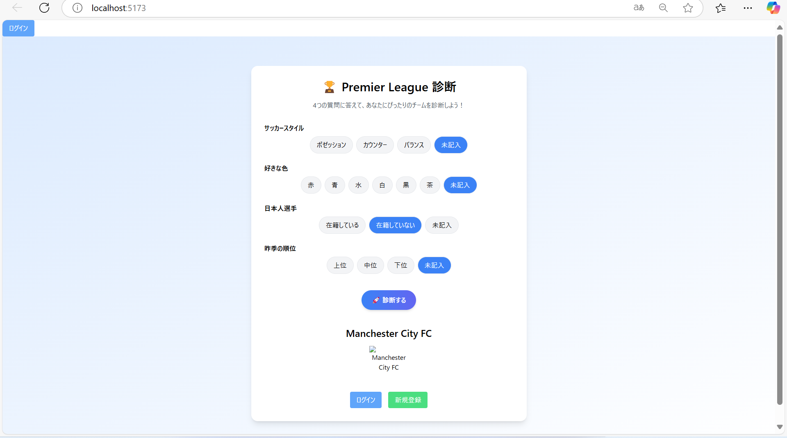

<div id="top"></div>

# Premier League診断アプリ


## 概要

このアプリは、プレミアリーグサッカーの知識がなくても、簡単な質問に答えるだけで、自分に合ったおすすめチームを診断するためのアプリです！

- 簡単な4つの質問で診断
- 診断結果にもとづきチーム情報を描画
- YouTubeの最新動画も表示
- Google認証でログイン＆マイページ保存

---

## 特徴

- サッカースタイルや色などの好みから診断
- YouTube APIやfootball-data.org APIと連携
- ログインはGoogle OAuthで完結
- テーマごとにユーザーページを生成

---

## 技術スタック

- **Docker**
- **FastAPI (Python)**
- **React (Vite)**
- **PostgreSQL**
- **Google OAuth**
- **YouTube API**
- **football-data.org API**
- SQLAlchemy
- Tailwind CSS

---

## 機能

### 診断画面

4つの質問に答えるだけで診断！


### 診断結果表示

診断結果として、あなたに合うチームを描画！



### Google認証でログイン

Googleアカウントで簡単にログイン。ログインすると自分のマイページを持てます！


### マイページ

おすすめされたチームの情報や、YouTubeの最新動画を確認！


### 設定画面

ユーザー名、お気に入りチーム、推し選手を設定して、自分だけのマイページを作れます！


---

## 環境構築

1. リポジトリをクローン

```sh
git clone [URL]
cd premier-team-selected
```

2. backend用の `.env` ファイルを作成

```plaintext
GEMINI_API_KEY=あなたのGemini APIキー
YOUR_API_KEY=あなたのfootball-data APIキー
YOUTUBE_API_KEY=あなたのYouTube APIキー
```

3. frontend用の `frontend/.env` ファイルを作成

```plaintext
VITE_API_ENDPOINT=http://localhost:8000
```

4. Dockerで起動

```sh
docker compose up --build
```

5. データベースに初期データを投入

```sh
docker exec -it premier-team-web-1 sh
python import_teams.py
python import_players.py
```

6. ブラウザで `http://localhost:5173` にアクセス

---

## エラー対処メモ

- Docker Desktopを立ち上げる
- `.env` を忘れずに作成する（credentials.jsonは不要）
- OAuthは必ずリダイレクトURL設定
- ビルド失敗したら `docker-compose build --no-cache`
- compose完了後、名前確認して `docker exec` コマンド

<p align="right">(<a href="#top">トップへ</a>)</p>
